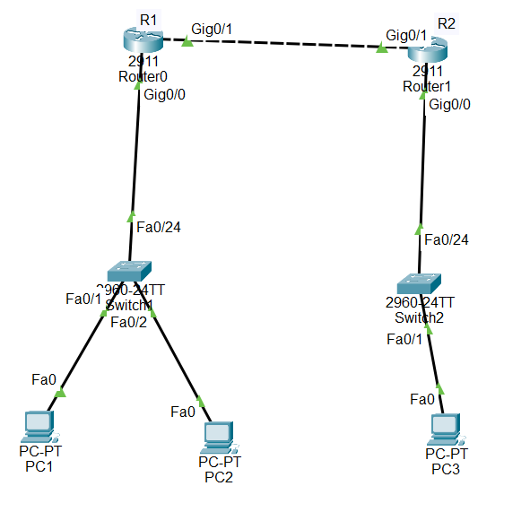

# ACL Network Access Lab

## Overview

This project demonstrates Cisco Access Control Lists (ACLs) using Cisco Packet Tracer.

The lab focuses on controlling network traffic using standard and extended ACLs while maintaining connectivity between two routed LANs.

## Objectives

- Configure two routed LAN networks.
- Configure static routing between R1 and R2.
- Configure a standard ACL to block a specific source host.
- Configure an extended ACL to block specific ICMP traffic.
- Verify permitted and denied traffic.
- Verify ACL counters and interface application.

## Topology

The network consists of:

- 2 Cisco 2911 routers
- 2 Cisco 2960 switches
- 3 PCs

### Connections

- PC1 → SW1 Fa0/1
- PC2 → SW1 Fa0/2
- PC3 → SW2 Fa0/1
- SW1 Fa0/24 → R1 G0/0
- SW2 Fa0/24 → R2 G0/0
- R1 G0/1 → R2 G0/1

## IP Addressing

### R1

    G0/0: 192.168.160.1/24
    G0/1: 10.30.30.1/30

### R2

    G0/0: 192.168.170.1/24
    G0/1: 10.30.30.2/30

### End Devices

    PC1: 192.168.160.10/24
    PC2: 192.168.160.20/24
    PC3: 192.168.170.10/24

### Default Gateways

    PC1: 192.168.160.1
    PC2: 192.168.160.1
    PC3: 192.168.170.1

## Routing Configuration

Static routes were configured to provide connectivity between the two LAN networks.

### R1

    ip route 192.168.170.0 255.255.255.0 10.30.30.2

### R2

    ip route 192.168.160.0 255.255.255.0 10.30.30.1

## Standard ACL Configuration

A standard ACL was configured on R1 to block PC1 from crossing the R1-R2 link.

### R1 Configuration

    access-list 10 deny host 192.168.160.10
    access-list 10 permit any

    interface gigabitEthernet 0/1
    ip access-group 10 out

### Result

- PC1 → PC3: Blocked
- PC2 → PC3: Allowed

This demonstrates source-based traffic filtering using a standard ACL.

## Extended ACL Configuration

An extended ACL was configured on R2 to block ICMP traffic from PC2 to PC3.

### R2 Configuration

    access-list 100 deny icmp host 192.168.160.20 host 192.168.170.10
    access-list 100 permit ip any any

    interface gigabitEthernet 0/1
    ip access-group 100 in

### Result

- PC2 → PC3 ICMP: Blocked
- ACL 100 deny counter increased

This demonstrates protocol-specific traffic filtering using an extended ACL.

## Verification

The following commands were used to verify the configuration:

    show ip route
    show access-lists
    show ip interface gigabitEthernet 0/1

### Connectivity Tests

Before applying the ACLs:

    PC1 → PC3: Successful
    PC2 → PC3: Successful
    R1 → R2: Successful
    PC3 → R2: Successful

After applying the standard ACL:

    PC1 → PC3: Unsuccessful
    PC2 → PC3: Successful

After applying the extended ACL:

    PC2 → PC3: Unsuccessful

ACL hit counters confirmed that the configured rules were matching the expected traffic.

## Key Concepts Demonstrated

- IPv4 addressing
- Static routing
- Standard ACLs
- Extended ACLs
- Source-based traffic filtering
- ICMP filtering
- Inbound ACL application
- Outbound ACL application
- ACL verification
- Network troubleshooting

## Project Files

- `acl-network-access-lab.pkt` — Cisco Packet Tracer project
- `topology.png` — Network topology image
- `README.md` — Project documentation

## Conclusion

This project demonstrates how Cisco ACLs can be used to control network traffic between routed networks.

A standard ACL was used to block a specific source host, while an extended ACL was used to block ICMP traffic between specific hosts. Static routing provided connectivity between the two LANs before access-control policies were applied.

Connectivity tests, ACL counters, and interface verification commands were used to confirm that the configured access-control policies were functioning as expected.
